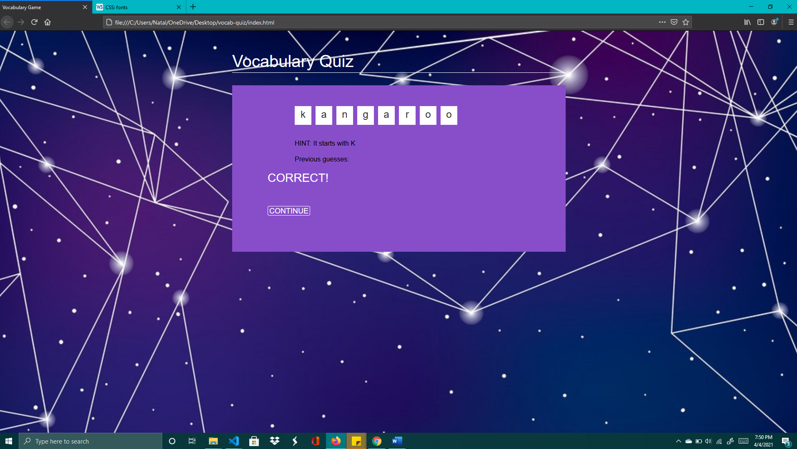

# Vocab Quiz
# Vocab Quiz Display

# Link to Published URL
https://natallie01.github.io/vocab-quiz/
 
# Purpose 
* A simple vocabulary game for kids to learn new words and enhance their diction.

# Description 
*  Create a simple Vocabulary Quiz application for students and teachers to utilize to enrich their vocabulary.

# What to Expect (Functionality)
* User initializes with begin button to start vocab quiz
* Empty boxes hold letters to spell out word
* As user enters letters it inserts the correct one into box
* If user enters incorrect letter it displays on previous guesses
* A hint is provided to help with creating the word